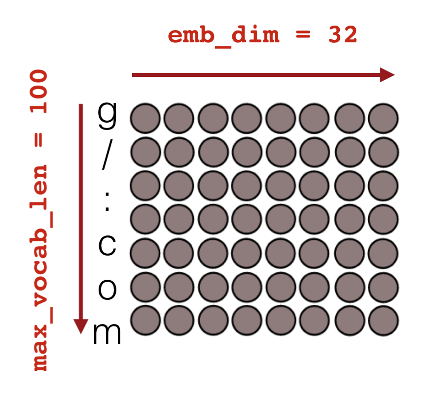

# Featureless Deep Learning for Detection of Malicious URLs

Melissa K (Dec 2017)

### Code

Go right away to the notebook that contains the code: [Featureless Deep Learning Malicious URL Detection notebook](FeaturelessDeepLearningMaliciousURLClassification.ipynb)

### Table of content

- [Motivation](#motivation)
- [Deep Learning Terminology](#deep-learning-terminology)
- [Data Collection](#data-collection)
- [Preprocessing Raw URLs](#preprocessing-raw-urls)
- [Word2vec Embedding](#word2vec-embedding)
- [Input and Output Layers of Neural Networks](#input-and-output-layers-of-neural-networks)
- [Convolution 1D with text data](#convolution-1d-with-text-data)
- [Deep Learning Architectures in Keras](#deep-learning-architectures-in-keras)
- [Training and Evaluation](#training-and-evaluation)
- [Save models to Disk](#save-models-to-disk)
- [Making a new Prediction](#making-a-new-prediction)
- [Conclusion](#conclusion)


Motivation
----------

The purpose of this project is to build a classifier that can detect malicious URLs.
This is accomplished using a Featureless Deep Learning approach.

The more traditional approach requires deriving hand-crafted features prior to training the Machine Learning classifier.
This can not only be the most tedious part, but also require advanced domain expertise and data wrangling skills. Furthermore,
additional data enrichment via API calls may be required as well for deriving those features.
An alternative approach can be Featureless Deep Learning, where an embedding layer takes care of deriving feature vectors from the raw data.
However, downsides of this approach are that more training samples are needed and the training phase is more time intensive.

Let's have a quick look at the more traditional approaches first. Previous academic research has focused on studying the usefulness of an exhausted list of candidate features. Below, I summarize some basic and most widely used "feature families" for this task.

There are 4 main "URL features families":

1. **BlackList Features**: Check if in any BlackList. BlackLists suffer from a high false negative rate, but can still be useful as Machine Learning feature.
2. **Lexical Features**: Based on methods from the field of Natural Language Processing. They capture the property that malicious URLs tend to "look different" from benign URLs. Therefore, lexical features quantify contextual information such as the length of the URL or the number of digits contained in the URL.
3. **Host-based Features**: They quantify properties of the web site host as identified in the hostname portion of the URL and basically answer "where" the site is hosted, "who" owns it and "how" it is managed. API queries are needed for this type of features (WHOIS, DNS records). Some example features can be the date of registration, the geolocations, autonomous system (AS) number, connection speed or time-to-live (TTL).
4. **Content-based Features**: This is one of the less commonly used feature families as it requires the download of the entire web-page, hence execution of the potential malicious site, which can not only be not safe, but also increases the computational cost of deriving features. Features here can be HTML or JavaScript based.

Source: Sahoo et al. 2017: [Malicious URL Detection using Machine Learning: A Survey](https://arxiv.org/pdf/1701.07179.pdf)

Deep Learning Terminology
-------------------------

Deep Learning is performed in an iterative fashion where a cost function is optimized until acceptable convergence just like many other Machine Learning algorithms.
The number of training examples (here URLs) that are used at a time is one important parameter in training a Deep Learning model
and is called **batch size**. More specifically, it is the number of training examples in one forward/backward pass (limited by RAM).
**Epoch** is one forward and backward pass of "all" training data. **Iterations** are the number of passes, where for each pass
 batch size number of training examples are used. For example, for 1000 training examples and batch size of 500 it will take 2 iterations
 to complete 1 epoch.


Data Collection
---------------

The dataset (containing both malicious and benign URLs to train the Deep Learning binary classifier) was custom build from various open source data sources.
Some of the open source URLs came with the zone apex only, others didn't include the protocol, therefore, we uniformly removed the protocol (http:// or https://) and the subdomain (e.g. www) from the URL string if applicable.

Benign

- Custom automated webscraping of [Alexa Top 1M](https://blog.majestic.com/development/majestic-million-csv-daily/) with recursive depth of scraping of level 1.

Malicious

- Various blacklists
- [openphish](https://openphish.com/)
- [phishtank](https://www.phishtank.com/)
- [public GitHub faizann24](https://github.com/faizann24/Using-machine-learning-to-detect-malicious-URLs)
- some more sources

The dataset is balanced (50% benign and 50% malicious) and contains 194798 URLs in total. Note that for training better Deep Learning classifiers much more data is needed.
In addition, the data may be a poor representation of the real world due to how the data was collected (e.g. only open source data were used instead of buying qualitative better and more recent data).
Malicious URLs tend to change over time, therefore, a continuous re-training on more current and representative data will be necessary for a production level quality.

Preprocessing Raw URLs
----------------------

For the Featureless Deep Learning approach, no hand-crafted features nor API queries (such as ```whois``` database) are needed.
However, limited pre-processing of the raw URLs is still necessary. The raw URL string needs to be
split into "words". Very easily done, every single character can be considered a "word". In addition, each
character has to be expressed as unique integer. This requires building a dictionary first. A short cut
can be considering Python's 100 printable characters only - of course suppose the URL is not in english this most likely won't do the trick.

```python
test_url = 'https://www.google.com/search?q=URL'
print([printable.index(x)+1 for x in test_url if x in printable])
```


One ingredient is still missing: All URLs have to be of the same length. This results in cropping or padding with zeros.
I choose a max length of 75 characters.

```python
# using keras library
max_len=75
X = sequence.pad_sequences(url_int_tokens, maxlen=max_len)
```

Word2vec Embedding
------------------

What's next? Where is the "featureless" part? That is accomplished through ```word2vec```.
I like to refer to tensorflow's documentation [word2vec tensorflow](https://www.tensorflow.org/tutorials/word2vec) for a more
detailed explanation. A short explanation is that a not very deep extra neural network is trained first to "embed" characters
that occur in the same "context", that is, are close-by in a n-dimensional
space. After that model has been trained the "real" deep neural network is trained.
 "n-dimensional" space? How do I know how many dimensions? You don't it's another parameter you can tune and therefore randomly pick.

Using the CBOW method the characters that surround a target character for which the embedding vector
is sought will be used as "context":


Defining the vocabulary size (here 100 since we used Python's 100 printable characters only) and
embedding dimension (here arbitrarily 32) are completely up to the researcher. The resulting model using my parameters is of shape:



Each character contained in the vocabulary has its own embedded vector. Below is a visualization of the word2vec embedding model matrix by projecting the n-dimensional vectors on 2D
(e.g. using [t-SNE](http://scikit-learn.org/stable/modules/generated/sklearn.manifold.TSNE.html)).
Interesting relationships of characters that tend to appear in similar contexts can be seen.


Source: Check out this fantastic blog on Featureless Deep Learning for URL Classification: [look-ma-no-features-deep-learning-methods-in-intrusion-detection](https://www.invincea.com/2017/02/look-ma-no-features-deep-learning-methods-in-intrusion-detection/).

I already mentioned that ```word2vec``` is trained first, then applied to each URL to "embed"/transform
the URL and thus derive it's "features", so that the actual
binary classifier (deep neural network) can be trained thereafter. Every single
embedded URL is of shape:


Since the deep neural network is trained in an iterative fashion, you end up with dimensions ```(None, max_len, embed_dim)``` for each
iteration in the training process. "None" is a Keras placeholder for the batch size!


Input and Output Layers of Neural Networks
------------------------------------------

Before moving on to some more fancy methods to further model the embedded 2D word2vec feature matrix, I would like to show what the input and output layers usually look like in [Keras](https://keras.io/).

The very first initial layer is always an input layer where you define the initial input shape (here initial 75 characters of the URL)

```python
# Input
 main_input = Input(shape=(max_len,), dtype='int32', name='main_input')
```

Next is the word2vec layer (see above), that builds upon the main input layer

```python
# Embedding layer
 emb = Embedding(input_dim=max_vocab_len, output_dim=emb_dim, input_length=max_len,
                dropout=0.2, W_regularizer=W_reg)(main_input)
```

This general process of "chaining" would continue...

```python
first_layer = <LayerType>(<parameters>)(main_input)
<next_layer> = <LayerType>(<parameters>)(first_layer)
<penultimate_layer> = <LayerType>(<parameters>)(<next_layer>)
```

...until the output layer where the actual classification takes place. Since this projects is about a binary classification task,
a ```sigmoid``` activation function is used. Furthermore, since the target vector containing the labels is a binary 1D vector the number of neurons
is ```1```! In a multi-class scenario the target vector would have needed to be one-hot encoded and the number of neurons would be n classes with a softmax activation function.

```python
# Output layer (last fully connected layer)
output = Dense(1, activation='sigmoid', name='output')(<penultimate_layer>)
```


Convolution 1D with text data
-----------------------------

Back to the "in-between" layers after the word2vec embedding layer. Now that there is a 2D array of "features" for each URL, what is next? In regular Machine Learning we only deal with feature vectors,
not feature matrices. As you may guess, there are several approaches. One is to have [LSTM](https://keras.io/layers/recurrent/#lstm)
layers. Without going into details, after running the recurrent network layer you end up with regular feature vectors and can then
add fully connected hidden layers or connect straight to the output layer. At the same time the network has learned the temporal structure of the
feature matrix, that is, the sequence of characters.

Or you could run [1D convolutions](https://keras.io/layers/convolutional/), also called temporal convolutions as shown in the figure
below. In contrast to 2D convolutions the width of the sliding window is of constant size of the emb_dim and the length
 (```filter_length``` or ```kernel_size```) here is 3 (see left panel). The window then slides along the embedded character sequence of the URL.
Since I used ```strides=1``` and ```"same" padding``` the resulting matrix
is a 2D matrix with the same number of rows, but
the dimension of the columns have changed to the number of "neurons" I specified (another parameter you can tune called ```nb_filter``` or ```filters```). This convolutional process is indeed like a filter where mini-neural networks are fitted to the data as the window slides. In the process a more latent sematic structure is learned. To end up with a regular feature matrix simply take the sum of the rows. Again,
 thereafter the fully connected hidden layers can follow.


Deep Learning Architectures in Keras
------------------------------------

LSTM or 1D convolutions can be used separately or together for the URL classification task.
In any case before arriving to the output layer, it is very common to add a few fully connected
hidden layers ("basic neural network/multilayer perceptron approach")

Finally, in every architecture the model has to be compiled while defining the
optimizer and parameters such as learning rate to train the model in an iterative
fashion as well as the loss function that quantifies how well the model is performing at each
iteration. Again for a multi-class problem the loss function would need to be changed.

```python
# Compile model and define optimizer
    model = Model(input=[main_input], output=[output])
    dam = Adam(lr=1e-4, beta_1=0.9, beta_2=0.999, epsilon=1e-08, decay=0.0)
    model.compile(optimizer=adam, loss='binary_crossentropy', metrics=['accuracy'])
```

See [Featureless Deep Learning Malicious URL Detection notebook](FeaturelessDeepLearningMaliciousURLClassification.ipynb):

1. **Simple LSTM**

```python
def simple_lstm(max_len=75, emb_dim=32, max_vocab_len=100, lstm_output_size=32, W_reg=regularizers.l2(1e-4)):
    # Input
    main_input = Input(shape=(max_len,), dtype='int32', name='main_input')
    # Embedding layer
    emb = Embedding(input_dim=max_vocab_len, output_dim=emb_dim, input_length=max_len,
                dropout=0.2, W_regularizer=W_reg)(main_input) 

    # LSTM layer
    lstm = LSTM(lstm_output_size)(emb)
    lstm = Dropout(0.5)(lstm)
    
    # Output layer (last fully connected layer)
    output = Dense(1, activation='sigmoid', name='output')(lstm)

    # Compile model and define optimizer
    model = Model(input=[main_input], output=[output])
    adam = Adam(lr=1e-4, beta_1=0.9, beta_2=0.999, epsilon=1e-08, decay=0.0)
    model.compile(optimizer=adam, loss='binary_crossentropy', metrics=['accuracy'])
    return model

```

2. **1D Convolution and LSTM**

```python
def lstm_conv(max_len=75, emb_dim=32, max_vocab_len=100, lstm_output_size=32, W_reg=regularizers.l2(1e-4)):
    # Input
    main_input = Input(shape=(max_len,), dtype='int32', name='main_input')
    # Embedding layer
    emb = Embedding(input_dim=max_vocab_len, output_dim=emb_dim, input_length=max_len,
                W_regularizer=W_reg)(main_input) 
    emb = Dropout(0.25)(emb)

    # Conv layer
    conv = Convolution1D(kernel_size=5, filters=256, \
                     border_mode='same')(emb)
    conv = ELU()(conv)

    conv = MaxPooling1D(pool_size=4)(conv)
    conv = Dropout(0.5)(conv)

    # LSTM layer
    lstm = LSTM(lstm_output_size)(conv)
    lstm = Dropout(0.5)(lstm)
    
    # Output layer (last fully connected layer)
    output = Dense(1, activation='sigmoid', name='output')(lstm)

    # Compile model and define optimizer
    model = Model(input=[main_input], output=[output])
    adam = Adam(lr=1e-4, beta_1=0.9, beta_2=0.999, epsilon=1e-08, decay=0.0)
    model.compile(optimizer=adam, loss='binary_crossentropy', metrics=['accuracy'])
    return model

```

3. **1D Convolutions and Fully Connected Layers**

```python
def conv_fully(max_len=75, emb_dim=32, max_vocab_len=100, W_reg=regularizers.l2(1e-4)):
    # Input
    main_input = Input(shape=(max_len,), dtype='int32', name='main_input')
    # Embedding layer
    emb = Embedding(input_dim=max_vocab_len, output_dim=emb_dim, input_length=max_len,
                W_regularizer=W_reg)(main_input) 
    emb = Dropout(0.25)(emb)

    
    def sum_1d(X):
        return K.sum(X, axis=1)
    
    def get_conv_layer(emb, kernel_size=5, filters=256):
        # Conv layer
        conv = Convolution1D(kernel_size=kernel_size, filters=filters, \
                     border_mode='same')(emb)
        conv = ELU()(conv)

        conv = Lambda(sum_1d, output_shape=(filters,))(conv)
        #conv = BatchNormalization(mode=0)(conv)
        conv = Dropout(0.5)(conv)
        return conv
        
    # Multiple Conv Layers
    
    # calling custom conv function from above
    conv1 = get_conv_layer(emb, kernel_size=2, filters=256)
    conv2 = get_conv_layer(emb, kernel_size=3, filters=256)
    conv3 = get_conv_layer(emb, kernel_size=4, filters=256)
    conv4 = get_conv_layer(emb, kernel_size=5, filters=256)

    # Fully Connected Layers
    merged = concatenate([conv1,conv2,conv3,conv4], axis=1)

    hidden1 = Dense(1024)(merged)
    hidden1 = ELU()(hidden1)
    hidden1 = BatchNormalization(mode=0)(hidden1)
    hidden1 = Dropout(0.5)(hidden1)

    hidden2 = Dense(1024)(hidden1)
    hidden2 = ELU()(hidden2)
    hidden2 = BatchNormalization(mode=0)(hidden2)
    hidden2 = Dropout(0.5)(hidden2)
    
    # Output layer (last fully connected layer)
    output = Dense(1, activation='sigmoid', name='output')(hidden2)

    # Compile model and define optimizer
    model = Model(input=[main_input], output=[output])
    adam = Adam(lr=1e-4, beta_1=0.9, beta_2=0.999, epsilon=1e-08, decay=0.0)
    model.compile(optimizer=adam, loss='binary_crossentropy', metrics=['accuracy'])
    return model


```


Training and Evaluation
-----------------------

Split data into train and test data (target vector is a 1D binary vector, no one-hot
encoding needed as it is a binary classification task).

```python
# Simple Cross-Validation: Split the data set into training and test data
X_train, X_test, target_train, target_test = model_selection.train_test_split(X, target, test_size=0.25, random_state=33)
```

After defining and compiling the neural network model and providing the number of epochs and batch size simply fit the model
very similarly to [sklearn](http://scikit-learn.org/stable/).


```python
nb_epoch = 5
batch_size = 32

model = <your architecture>

model.fit(X_train, target_train, epochs=epochs, batch_size=batch_size)
loss, accuracy = model.evaluate(X_test, target_test, verbose=1)
```

If you wanted to print out the layers, you can achieve this with the following function

```python
def print_layers_dims(model):
    l_layers = model.layers
    # Note None is ALWAYS batch_size
    for i in range(len(l_layers)):
        print(l_layers[i])
        print('Input Shape: ', l_layers[i].input_shape, 'Output Shape: ', l_layers[i].output_shape)
        
print_layers_dims(model)
```

Save Models to Disk
-------------------

This step is very essential to Deep Learning since training the model can take a while.

```python
# GENERAL save model to disk function!
def save_model(fileModelJSON,fileWeights):
    #print("Saving model to disk: ",fileModelJSON,"and",fileWeights)
    #have h5py installed
    if Path(fileModelJSON).is_file():
        os.remove(fileModelJSON)
    json_string = model.to_json()
    with open(fileModelJSON,'w' ) as f:
        json.dump(json_string, f)
    if Path(fileWeights).is_file():
        os.remove(fileWeights)
    model.save_weights(fileWeights)
    

# GENERAL load model from disk function!
def load_model(fileModelJSON,fileWeights):
    #print("Saving model to disk: ",fileModelJSON,"and",fileWeights)
    with open(fileModelJSON, 'r') as f:
         model_json = json.load(f)
         model = model_from_json(model_json)
    
    model.load_weights(fileWeights)
    return model
```

For example, save the 1D Convolution + LSTM model to disk and load it later to make new predictions.

```python
model_name = "deeplearning_1DConvLSTM"
save_model(DATA_HOME + model_name + ".json", DATA_HOME + model_name + ".h5")
model = load_model(DATA_HOME + model_name + ".json", DATA_HOME + model_name + ".h5")
```


Making a New Prediction
-----------------------

In contrast to more traditional Machine Learning, where preprocessing and/or feture engineering can be quite tedious to transform a new URL into feature vector space, it's quite straight forward in the approach proposed here.

1. Convert raw URL string in list of lists where characters that are contained in "printable" are stored encoded as integer.

```python
test_url_mal = "naureen.net/etisalat.ae/index2.php"
test_url_benign = "sixt.com/php/reservation?language=en_US"

url = test_url_benign
url_int_tokens = [[printable.index(x) + 1 for x in url if x in printable]]
```

2. Cut URL string at max_len or pad with zeros if shorter

```python
max_len=75
X = sequence.pad_sequences(url_int_tokens, maxlen=max_len)
```

3. Make a new prediction with trained model

```python
target_proba = model.predict(X, batch_size=1)
def print_result(proba):
    if proba > 0.5:
        return "malicious"
    else:
        return "benign"
print("Test URL:", url, "is", print_result(target_proba[0]))
```

Conclusion
----------

What I like about the Deep Learning approach for URL classification is that it doesn't require hand-crafted features and
domain knowledge. Training time is definitely longer and accuracy not necessarily better when compared
to more traditional Machine Learning, however it may generalize better to
tomorrow's malicious URLs.


